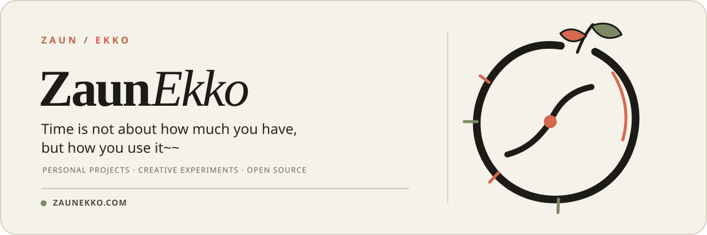

  <strong>English</strong> ·
  <a href="./README.md">简体中文</a> ·
  <a href="./README.ja-JP.md">日本語</a> ·
  <a href="./README.pt-BR.md">Português do Brasil</a> ·
  <a href="./README.es.md">Español</a> ·
  <a href="./README.ru-RU.md">Русский</a>

  

  <a href="https://zaunekko.com">Official Website</a>
  &nbsp;·&nbsp;
  <a href="https://github.com/orgs/zaunekko-official/repositories">Browse Repositories</a>

---

## This is ZaunEkko

A home for personal projects, creative experiments, and open-source work intended for long-term maintenance.

Rather than making every idea sound grand, the priority here is simple: **complete it with care, then explain the process clearly.**

### In progress

> The first public projects are still in preparation. When they are ready to be shared, this is where they will appear.

### What’s ahead

- Small tools and projects ready to use
- Experiments across technology and creative practice
- Complete documentation, update logs, and ways to contribute

### Find me

For more information and other links, visit [zaunekko.com](https://zaunekko.com).
