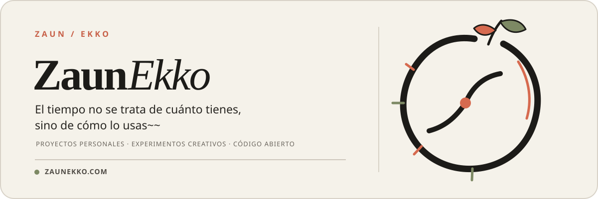

  <a href="./README.en.md">English</a> ·
  <a href="./README.md">简体中文</a> ·
  <a href="./README.ja-JP.md">日本語</a> ·
  <a href="./README.pt-BR.md">Português do Brasil</a> ·
  <strong>Español</strong> ·
  <a href="./README.ru-RU.md">Русский</a>

  

  <a href="https://zaunekko.com">Sitio web oficial</a>
  &nbsp;·&nbsp;
  <a href="https://github.com/orgs/zaunekko-official/repositories">Explorar repositorios</a>

---

## Esto es ZaunEkko

Un espacio para proyectos personales, experimentos creativos y trabajo de código abierto pensado para el mantenimiento a largo plazo.

En lugar de hacer que cada idea parezca más grande de lo que es, aquí importa algo sencillo: **terminarla con cuidado y, después, explicar el proceso con claridad.**

### En proceso

> Los primeros proyectos públicos todavía se están preparando. Cuando estén listos para compartirse, aparecerán aquí.

### Lo que viene

- Herramientas y proyectos pequeños, listos para usar
- Experimentos en tecnología y creatividad
- Documentación completa, historial de actualizaciones y formas de participar

### Más información

Para más información y otros enlaces, visita [zaunekko.com](https://zaunekko.com).
