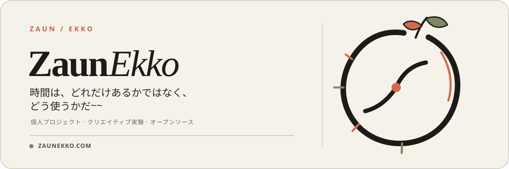

  <a href="./README.en.md">English</a> ·
  <a href="./README.md">简体中文</a> ·
  <strong>日本語</strong> ·
  <a href="./README.pt-BR.md">Português do Brasil</a> ·
  <a href="./README.es.md">Español</a> ·
  <a href="./README.ru-RU.md">Русский</a>

  

  <a href="https://zaunekko.com">公式サイト</a>
  &nbsp;·&nbsp;
  <a href="https://github.com/orgs/zaunekko-official/repositories">リポジトリを見る</a>

---

## ここは ZaunEkko です

個人プロジェクト、クリエイティブな実験、そして長期的にメンテナンスしていくオープンソースの取り組みを置く場所です。

アイデアを必要以上に大きく見せるよりも、ここではひとつのことを大切にしています。**まず丁寧に完成させてから、その過程をきちんと伝えること。**

### 準備中

> 最初の公開プロジェクトは、まだ準備中です。共有できる状態になったら、ここで公開します。

### これから

- すぐに使える小さなツールやプロジェクト
- 技術と創作にまたがる実験
- 充実したドキュメント、更新履歴、参加方法

### もっと知る

詳しい情報やその他のリンクは、[zaunekko.com](https://zaunekko.com) からご覧いただけます。
