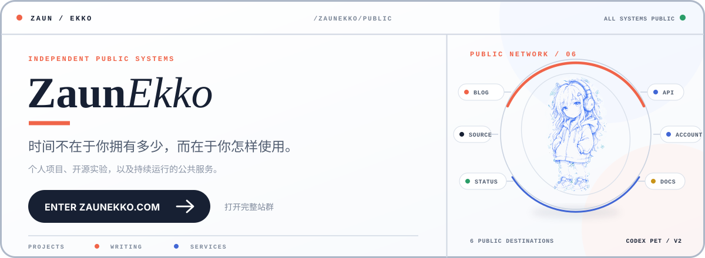
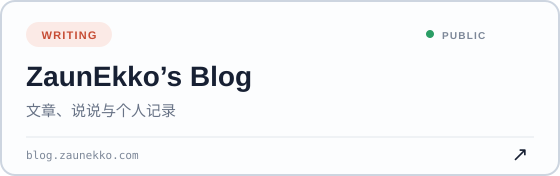
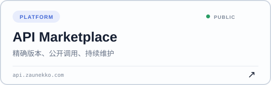
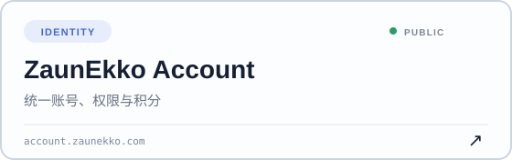
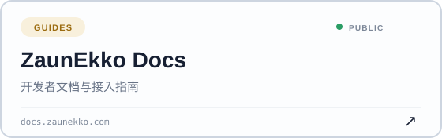
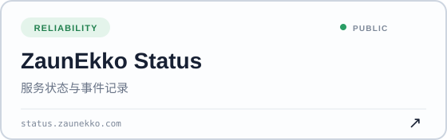
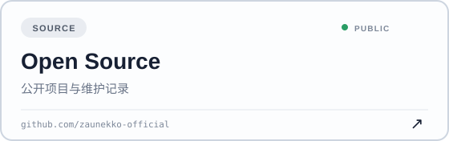

  <a href="./README.en.md">English</a> ·
  <strong>简体中文</strong> ·
  <a href="./README.ja-JP.md">日本語</a> ·
  <a href="./README.pt-BR.md">Português do Brasil</a> ·
  <a href="./README.es.md">Español</a> ·
  <a href="./README.ru-RU.md">Русский</a>

  

## 站点网络

从 <a href="https://zaunekko.com"><strong>zaunekko.com</strong></a> 进入完整站群，或直接打开你需要的服务。

  
  

  
  

  
  

## 公开项目

- **[`codex-pets`](https://github.com/zaunekko-official/codex-pets)** — 钴蓝手绘风 Codex 动态宠物，包含完整 v2 动作图集、16 个看向方向与跨平台安装脚本。
- **[`.github`](https://github.com/zaunekko-official/.github)** — 组织首页、社区配置与多语言资料。

  <a href="https://zaunekko.com"><strong>进入 ZAUNEKKO.COM →</strong></a>

