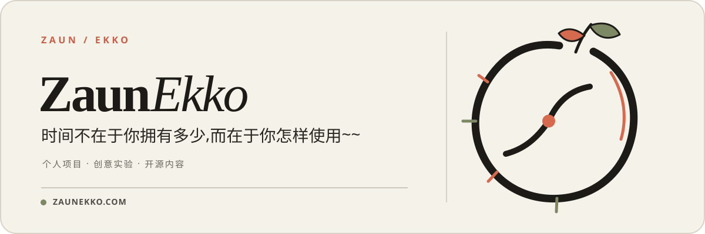

  <a href="./README.en.md">English</a> ·
  <strong>简体中文</strong> ·
  <a href="./README.ja-JP.md">日本語</a> ·
  <a href="./README.pt-BR.md">Português do Brasil</a> ·
  <a href="./README.es.md">Español</a> ·
  <a href="./README.ru-RU.md">Русский</a>

  

  <a href="https://zaunekko.com">官方网站</a>
  &nbsp;·&nbsp;
  <a href="https://github.com/orgs/zaunekko-official/repositories">浏览仓库</a>

---

## 这里是 ZaunEkko

用来安放个人项目、创意实验，以及准备长期维护的开源内容。

比起把每个想法都包装得很大，这里更在意一件事：**先把它认真做完，再把过程说明白。**

### 正在整理

> 首批公开项目仍在准备中。完成到值得分享的时候，它们会从这里开始。

### 以后会出现

- 能直接使用的小工具和项目
- 技术与创意方向的实验
- 完整的文档、更新记录与参与方式

### 找到我

更多信息与其他入口，可以前往 [zaunekko.com](https://zaunekko.com)。
