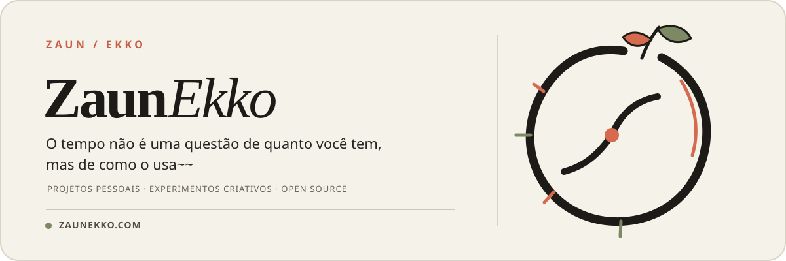

  <a href="./README.en.md">English</a> ·
  <a href="./README.md">简体中文</a> ·
  <a href="./README.ja-JP.md">日本語</a> ·
  <strong>Português do Brasil</strong> ·
  <a href="./README.es.md">Español</a> ·
  <a href="./README.ru-RU.md">Русский</a>

  

  <a href="https://zaunekko.com">Site oficial</a>
  &nbsp;·&nbsp;
  <a href="https://github.com/orgs/zaunekko-official/repositories">Explorar repositórios</a>

---

## Este é o ZaunEkko

Um espaço para projetos pessoais, experimentos criativos e trabalho open source com a manutenção de longo prazo em mente.

Em vez de fazer cada ideia parecer maior do que é, a prioridade aqui é simples: **levá-la até o fim com cuidado e, depois, explicar o processo com clareza.**

### Em andamento

> Os primeiros projetos públicos ainda estão sendo preparados. Quando estiverem prontos para serem compartilhados, aparecerão aqui.

### O que vem por aí

- Ferramentas e projetos pequenos, prontos para usar
- Experimentos em tecnologia e criação
- Documentação completa, registros de atualização e formas de participar

### Saiba mais

Para mais informações e outros links, acesse [zaunekko.com](https://zaunekko.com).
