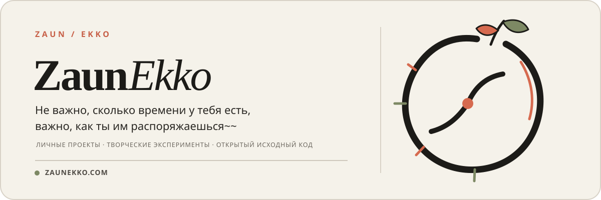

  <a href="./README.en.md">English</a> ·
  <a href="./README.md">简体中文</a> ·
  <a href="./README.ja-JP.md">日本語</a> ·
  <a href="./README.pt-BR.md">Português do Brasil</a> ·
  <a href="./README.es.md">Español</a> ·
  <strong>Русский</strong>

  

  <a href="https://zaunekko.com">Официальный сайт</a>
  &nbsp;·&nbsp;
  <a href="https://github.com/orgs/zaunekko-official/repositories">Посмотреть репозитории</a>

---

## Это ZaunEkko

Место для личных проектов, творческих экспериментов и разработок с открытым исходным кодом, рассчитанных на долгосрочную поддержку.

Вместо того чтобы придавать каждой идее чрезмерный масштаб, здесь важнее другое: **сначала основательно довести её до конца, а затем ясно рассказать о процессе.**

### В процессе

> Первые публичные проекты пока готовятся. Когда ими можно будет поделиться, они появятся здесь.

### Дальше

- Небольшие инструменты и проекты, которыми можно пользоваться сразу
- Эксперименты на стыке технологий и творчества
- Полная документация, журнал обновлений и способы участия

### Узнать больше

Больше информации и другие ссылки — на [zaunekko.com](https://zaunekko.com).
